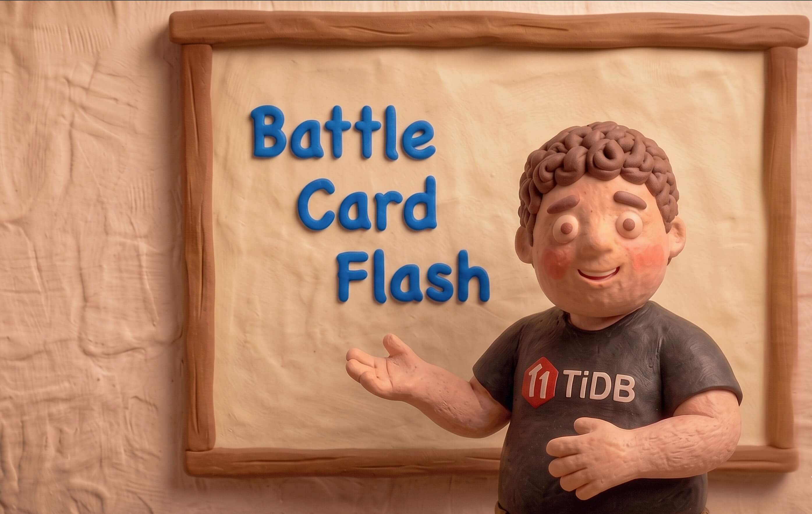

<p align="center">
  
</p>

<h1 align="center">Battle Card Flash</h1>

<p align="center">
  <strong>Generate professional database comparison battle cards in seconds, powered by AI.</strong>
</p>

<p align="center">
  
  
  
  
  
  
</p>

---

## Why Battle Card Flash?

Sales engineers and solution architects spend hours manually building database comparison decks. The data is scattered, the analysis is subjective, and the formatting is tedious.

**Battle Card Flash** solves this by:

- **Automating the comparison** — Pre-loaded feature data for databases across many technical dimensions
- **Tailoring to your audience** — Industry-specific strategies prioritize what matters (latency for gaming, ACID for fintech, vector search for AI)
- **Adding AI-powered analysis** — LLM-generated executive summaries, key differentiators, and recommendations with many provider choices
- **Producing ready-to-present output** — Professional PowerPoint slides with feature tables, case studies, and expert analysis

One wizard. Four clicks. A polished battle card.

---

## How to Use

### Prerequisites

- Python 3.9+
- An LLM API key (optional but recommended for AI analysis)

### Install

```bash
git clone https://github.com/your-username/CardGen.git
cd CardGen
pip install -r requirements.txt
```

### Configure LLM (Optional)

Set an API key for your preferred AI provider. Qwen is the default:

```bash
export DASHSCOPE_API_KEY="your-key-here"
```

Other supported providers:

| Provider | Environment Variable | Model |
|----------|---------------------|-------|
| **Qwen** (default) | `DASHSCOPE_API_KEY` | qwen3.5-plus |
| ChatGPT | `OPENAI_API_KEY` | gpt-4o |
| Claude | `ANTHROPIC_API_KEY` | claude-sonnet-4-20250514 |
| Gemini | `GEMINI_API_KEY` | gemini-2.0-flash |
| DeepSeek | `DEEPSEEK_API_KEY` | deepseek-chat |

### Run

```bash
python main.py
```

By default the app uses a local SQLite database. To use **TiDB Cloud Serverless** instead, see the [TiDB Cloud Serverless](#tidb-cloud-serverless) section below.

### Wizard Flow

1. **Select Database** — Pick a target database to compare against TiDB
2. **Select Industry** — Choose an industry vertical (AI, Gaming, eCommerce, Fintech, SaaS, Retail)
3. **Customize Features** — Check/uncheck features, add extras, select your AI model
4. **Generate** — The app builds the comparison, calls the LLM, and produces a PowerPoint file in `output/`

The app works without an API key — AI analysis will show "unavailable" but the feature comparison and case studies still generate.

### Supported Databases

TiDB (baseline), MySQL, PostgreSQL, CockroachDB, Amazon Aurora, Google Spanner, MongoDB, PlanetScale, SingleStore, OceanBase

---

## Architecture

### Project Structure

```
CardGen/
├── main.py                          # Entry point
├── models/
│   └── entities.py                  # Data models (Product, Industry, Feature, etc.)
├── db/
│   ├── schema.py                    # SQLite + TiDB Cloud schema & auto-seeding
│   └── repository.py                # Repository pattern (SQLite + TiDB Cloud)
├── services/
│   ├── comparison_service.py        # Comparison orchestration
│   ├── industry_strategy.py         # Industry-specific comparison strategies
│   ├── llm_service.py               # Multi-provider LLM integration
│   └── ppt_generator.py             # PowerPoint slide builders
├── ui/
│   ├── app.py                       # App state + routing
│   ├── step1_select_db.py           # Step 1: Database selection
│   ├── step2_select_industry.py     # Step 2: Industry selection
│   ├── step3_features.py            # Step 3: Feature customization
│   └── step4_generate.py            # Step 4: Generation + output
├── seed_data.sql                    # Products, industries, features, case studies
├── BattleCardFlashTmp.pptx          # PowerPoint template
└── output/                          # Generated battle cards
```

### Design Patterns

The codebase uses five classic design patterns to keep things modular and extensible:

**Repository Pattern** (`db/repository.py`)
`AbstractRepository` defines the data access interface. Two implementations — `SQLiteRepository` (default, zero-config) and `TiDBCloudRepository` (cloud-native, via `pymysql`). The `RepositoryFactory` selects the backend based on environment variables. Swap backends without touching any service or UI code.

**Strategy Pattern** (`services/industry_strategy.py`, `services/llm_service.py`)
Each industry has its own strategy class that defines priority feature categories and a tailored LLM prompt. Each LLM provider is also a strategy, making it trivial to add new AI models.

**Factory Pattern** (`RepositoryFactory`, `StrategyFactory`, `LLMProviderFactory`, `PPTGeneratorFactory`)
Centralized object creation with registry-based lookup. Adding a new industry, LLM provider, or slide type is a one-class-one-registration change.

**Observer Pattern** (`ui/app.py` → `AppState`)
The wizard state is shared across all four steps via an observable `AppState` object with listener callbacks, keeping UI components decoupled.

**Builder Pattern** (`services/ppt_generator.py`)
Three `SlideBuilder` implementations — `FeatureTableSlideBuilder`, `CaseStudySlideBuilder`, `LLMSuggestionSlideBuilder` — each build one section of the final PPT independently.

### Data Flow

```
User Input → AppState
                ↓
         ComparisonService
           ├── Repository → feature values, expert advice, case studies
           └── ComparisonResult
                ↓
         LLMService
           ├── Industry Strategy → tailored prompt
           └── LLM Provider → AI analysis
                ↓
         PPTGenerator
           ├── FeatureTableSlideBuilder
           ├── CaseStudySlideBuilder
           └── LLMSuggestionSlideBuilder
                ↓
         output/*.pptx
```

---

## Tech Stack

- **UI**: [Flet](https://flet.dev/) 0.28.3 (Flutter-based Python UI)
- **Database**: SQLite (default) or [TiDB Cloud Serverless](https://tidbcloud.com/) (via `pymysql`)
- **PPT Generation**: [python-pptx](https://python-pptx.readthedocs.io/)
- **AI**: Multi-provider — Qwen, ChatGPT, Claude, Gemini, DeepSeek
- **Language**: Python 3.9+

---

## TiDB Cloud Serverless

The app supports [TiDB Cloud Serverless](https://tidbcloud.com/) as an alternative database backend. This lets you store comparison data in the cloud and share it across machines.

### Setup

1. Create a free TiDB Cloud Serverless cluster at [tidbcloud.com](https://tidbcloud.com/)
2. Get your connection details from the cluster's **Connect** dialog
3. Set environment variables and run:

```bash
export TIDB_HOST="gateway01.us-west-2.prod.aws.tidbcloud.com"
export TIDB_PORT="4000"
export TIDB_USER="your_username"
export TIDB_PASSWORD="your_password"
export TIDB_DB_NAME="battlecard"

python main.py
```

The app auto-detects `TIDB_HOST` — if set, it uses TiDB Cloud; otherwise it falls back to local SQLite. Tables and seed data are created automatically on first connection.

### How It Works (Repository Pattern)

```
                    AbstractRepository (ABC)
                     /                \
        SQLiteRepository      TiDBCloudRepository
         (sqlite3)               (pymysql + SSL)
                     \                /
                    RepositoryFactory.create()
                            ↑
                    TIDB_HOST env var?
                    ├── Yes → "tidb"
                    └── No  → "sqlite"
```

No service or UI code changes — the Factory pattern handles backend selection transparently.
